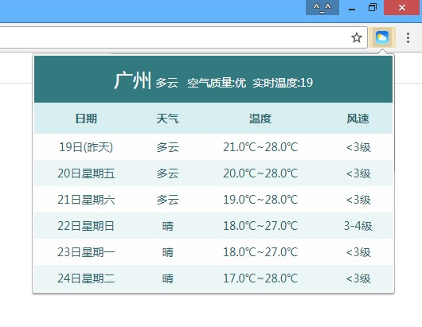
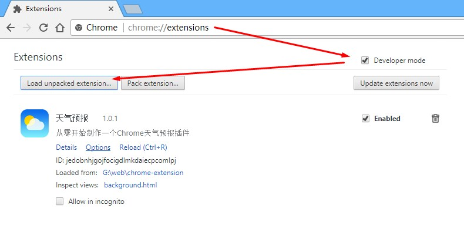
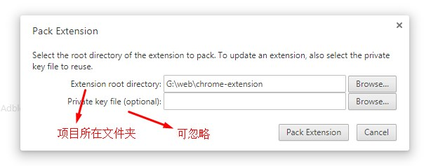

# Chrome天气预报插件 :sunny: 
一个可以获取展示所在地天气预报的Chrome插件

## 安装插件
1. 下载本项目中的chrome-extension.crx文件到电脑中
2. 将crx文件直接拖放到Chrome浏览器
3. 按照提示同意，即可完成本扩展的安装
    

## 开发插件
1. 下载本项目到电脑中
2. 浏览器地址栏输入：chrome://extensions/
3. 勾上“Developer mode”开发者模式
4. 点击“Load unpacked extension...”按钮
5. 在弹出的选择框中选中本项目所在文件夹即可进入开发模式

## 打包插件
将本扩展程序打包为crx文件

1. 下载本项目到电脑中
2. 浏览器地址栏输入：chrome://extensions/
3. 勾上“Developer mode”开发者模式
4. 点击“Pack extension”按钮
5. 在弹出的选择框中选中本项目所在文件夹即可打包

打包完成后会在项目上一级目录生成扩展.crx文件和密钥.pem文件，
留取chrome-extension.crx文件即可

